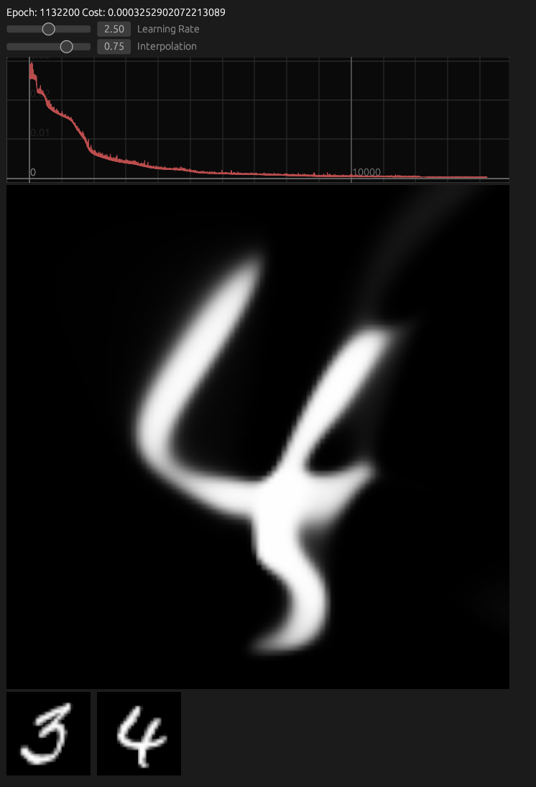
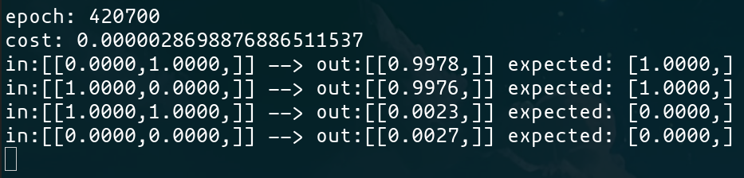

# [WIP] Snail NN - smol neural network library

fully functional neural network libary with backpropagation and parallelized stochastic gradient descent implementation.


## Examples

Storing images inside the neural network, upscaling and interpolate between them.


```bash
cargo run --example imagepol --release
```


---

The mandatory xor example

```bash
cargo run --example xor --release
```



---

Example Code:
```rust
use snail_nn::prelude::*;

fn main(){
    let mut nn = Model::new(&[2, 3, 1]);
    nn.set_activation(Activation::Sigmoid)

    let mut batch = TrainingBatch::empty(2, 1);
    let rate = 1.0;

    // AND - training data
    batch.add(&[0.0, 0.0], &[0.0]);
    batch.add(&[1.0, 0.0], &[0.0]);
    batch.add(&[0.0, 1.0], &[0.0]);
    batch.add(&[1.0, 1.0], &[1.0]);

    for _ in 0..10000 {
        let (w_gradient, b_gradient) = nn.gradient(&batch.random_chunk(2));
        nn.learn(w_gradient, b_gradient, rate);
    }

    println!("ouput {:?} expected: 0.0", nn.forward(&[0.0, 0.0]));
    println!("ouput {:?} expected: 0.0", nn.forward(&[1.0, 0.0]));
    println!("ouput {:?} expected: 0.0", nn.forward(&[0.0, 1.0]));
    println!("ouput {:?} expected: 1.0", nn.forward(&[1.0, 1.0]));
}
```

##  Features

- Sigmoid, Tanh & Relu activation functions
- Parallelized stochastic gradient descent
- It works on my machine ¯\\_(ツ)_/¯
- Will gobble up most of your cpu


## Todo

- more examples
- better documentation
- compute shaders with wgpu
